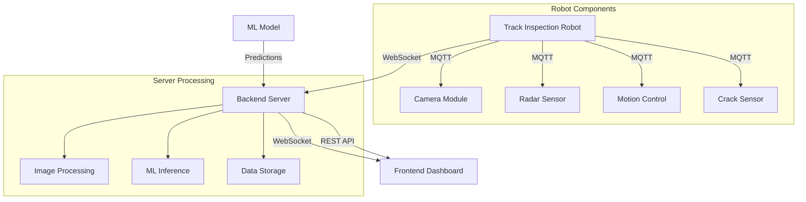

# Railway Track Crack Detection System 🚂

> Final Year Engineering Project - 2025  
> Department of Computer Science and Engineering

A real-time railway track monitoring system that leverages computer vision, machine learning, and IoT technologies to detect and analyze cracks in railway tracks. The system combines a mobile robot unit for track inspection with a web-based monitoring dashboard.


*(System architecture diagram)*

## 📌 Project Overview

This project addresses the critical need for automated railway track inspection by developing an integrated system that:
- Autonomously detects track defects using computer vision
- Provides real-time monitoring through a web dashboard
- Enables remote control of the inspection robot
- Offers instant alerts for detected anomalies

### 🎯 Key Features

#### Real-time Monitoring Dashboard
- Live inspection status and robot control
- Interactive map showing detection locations
- Real-time radar visualization for obstacle detection
- Historical data of detected cracks

#### ML-Powered Detection System
- Custom-trained crack detection model
- Severity classification
- Confidence scoring
- Support for multiple image formats

#### IoT Integration
- Autonomous track inspection robot
- Real-time data transmission
- WebSocket-based communication
- Radar-based obstacle avoidance

## 🏗️ System Architecture

### Component Overview



### Technology Stack

#### Frontend
- React.js with Material-UI and Tailwind CSS
- Socket.io for real-time communication
- Leaflet for map visualization
- Axios for HTTP requests

#### Backend
- Flask web framework
- TensorFlow for ML model serving
- Flask-SocketIO for real-time communication
- Python image processing pipeline

## 💻 Installation

### Prerequisites
- Node.js (v14+)
- Python (v3.8+)
- pip package manager

### Frontend Setup

- Clone repository
`git clone https://github.com/xRiddin/Railway-track-fault-detection-system-IOT.git`
- Navigate to frontend directory
`cd frontend`
- Install dependencies
`npm install`
- Start development server
`npm start`

### Backend Setup

- Navigate to backend directory
`cd backend`

- Create virtual environment
`python -m venv venv`

- Activate virtual environment
```
source venv/bin/activate  # Linux/Mac
venv\Scripts\activate     # Windows
```

- Install dependencies
`pip install -r requirements.txt`

- Start server
`python server.py`

## 🔌 API Documentation

### REST Endpoints
| Endpoint | Method | Description |
|----------|--------|-------------|
| `/api/detections` | GET | Retrieve all crack detections |
| `/api/upload` | POST | Upload image for analysis |
| `/api/start` | GET | Start robot inspection |
| `/api/stop` | GET | Stop robot inspection |

### WebSocket Events
| Event | Description |
|-------|-------------|
| `new_crack_detection` | New crack detected |
| `radar_update` | Radar data update |
| `connected` | Connection status |
| `message` | System messages |

## 📊 Dashboard Features

### Main Dashboard
- Real-time status monitoring
- Interactive map with detection markers
- Radar simulation display
- Recent detections list

### ML Model Interface
- Image upload and analysis
- Real-time prediction results
- Confidence scoring visualization

# 🚀 Deployment

## Frontend

### Build production bundle
`npm run build`

## Backend

### Using gunicorn
`
gunicorn -k geventwebsocket.gunicorn.workers.GeventWebSocketWorker -w 1 server:app`

## 📄 License

This project is licensed under the MIT License - see the [LICENSE](LICENSE) file for details.

---
*This project was developed as part of the final year engineering project at my University , 2025.*

